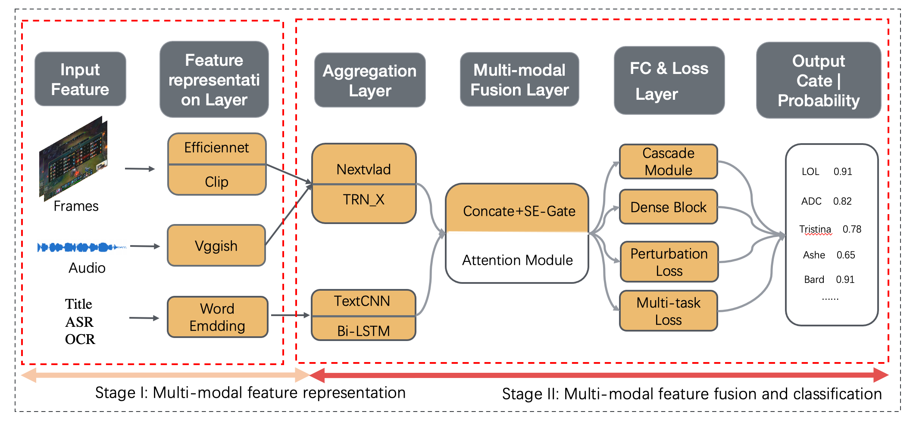
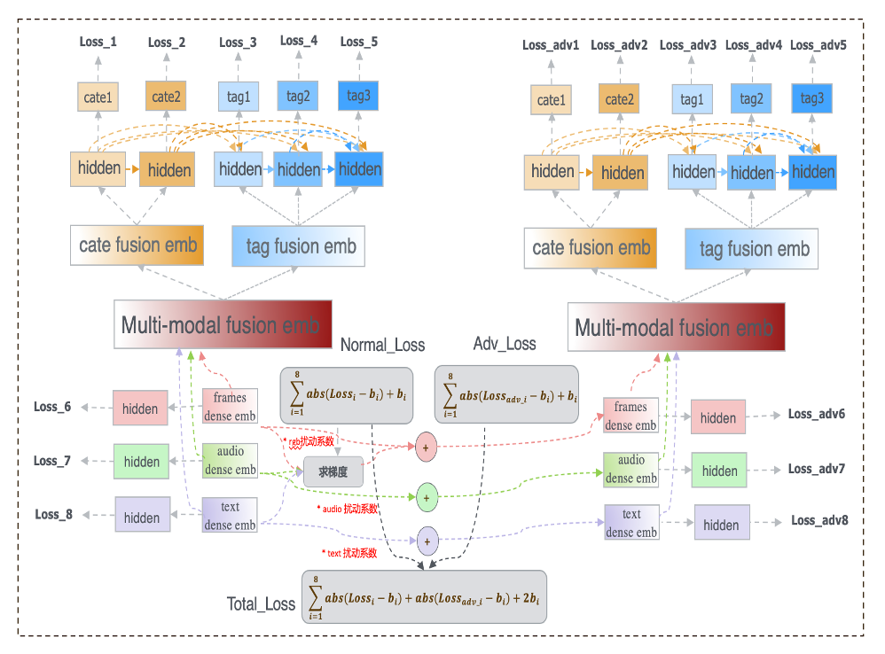

## 1、Introduction

This project designed and implemented a  "General Multi-model Video Classification Frameworks", including the overall process of training and predicting. The source code based on tensorflow-1.14 platform.

The specific supported functions are as follows:


- [x] Video cate classification tasks（multi-classes）
- [x] Video tag classification tasks（multi-labels）
- [x] Text vector aggregation:  textCNN and Bi-LSTM
- [x] Video frames and audio frames aggregation : nextvlad and trn
- [x] Adversarial perturbation（improving the robustness and generalization capabilities of the model）
- [x] Multi-gpus based on single machine
- [x] Eval metrics:  Precison, Recall, F1,GAP and mAP
- [x] Multi-task learning: cate & tag classification
- [x] Generate the multi-modal video embedding: which can be used to construct similar video recall and other tasks


## 2、Framework


The architecture of "General Multi-model Video Classification Frameworks" includes two stages: 

​			Stage1: Multi-modal feature representation

​			Stage II: Multi-modal feature fusion and classification




### 2.1 Modal Aggreration Module

#### 		2.1.1. Nextvald 


#### 		2.1.2. TRN


#### 		2.1.3. TextCNN


#### 		2.1.4. Bi-LSTM


### 2.2 Multi-modal Funsion


#### 	2.2.1.  GateFunsion Block


#### 2.2.2. SE-Gate Block


### 2.3 Adversarial Perturbation Loss




## 3、Directory Structure

```shell
├── README.md         -->documentation
├── requirements.txt  -->environment dependencies
├── scripts
│   ├── infer.sh      --> pipeline for predict       
│   └── train.sh      --> pipeline for train
└── src
    ├── data.py							--> process for data
    ├── eval_metrics.py     --> eval metrics
    ├── models.py           --> the implementation of each model
    ├── train.py            --> the entrance of train of predict
    ├── utils.py            --> multi-gpus
    └── video_model.py      --> the whole framework of model           

```


## 4、How to run 

#### 	4.1.  install the environment

```
pip install -r requirements.txt
```

#### 	4.2. Train process  

```
cd ~
sh scripts/train.sh

```

#### 	4.3.  Predict process

```
cd ~
sh scripts/infer.sh
```


## 5、Experimental Results


**Tips: *For any other* inquiries, kindly *contact* me through this email : stoneyezhenxu@gmail.com**

